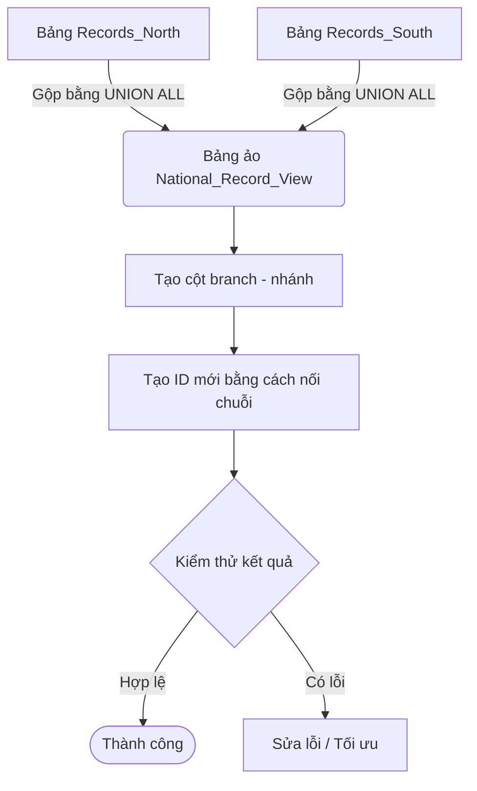

# Mô tả luồng hoạt động của bài tập sáng tạo 

```mermaid
graph TD
    A[Bảng Records_North] & B[Bảng Records_South] -->|Gộp bằng UNION ALL| C(Bảng ảo National_Record_View)
    C --> D[Tạo cột branch - nhánh]
    D --> E[Tạo ID mới bằng cách nối chuỗi]
    E --> F{Kiểm thử kết quả}
    F -->|Hợp lệ| G([Thành công])
    F -->|Có lỗi| H[Sửa lỗi / Tối ưu]
```
